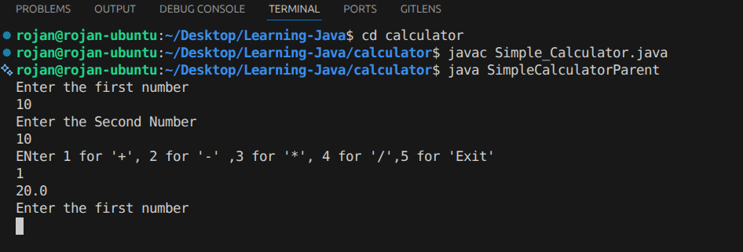
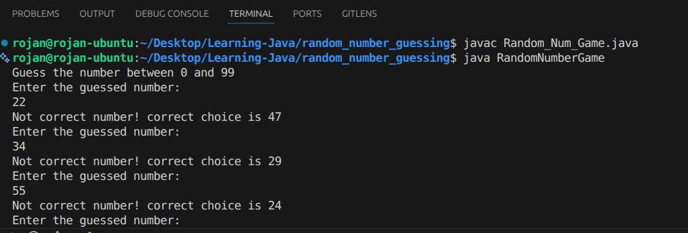
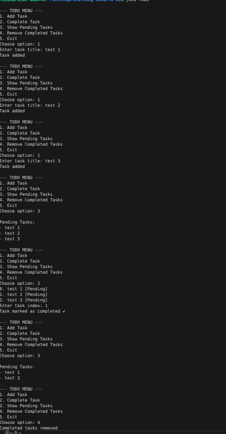

# ☕ Java Learning Journey

> A collection of projects I've built while learning Java from the ground up.

---

## 📋 Table of Contents
- [About](#about)
- [Projects](#projects)
  - [Calculator](#calculator)
  - [Random Number Game](#random-number-game)
  - [ATM System](#atm-system)
  - [Todo App](#todo-app)
- [Technologies](#technologies)
- [What's Next](#whats-next)

---

## About

This repository is my personal space to track my progress as I learn **Java**. Every project here was built hands-on to understand core concepts like OOP, user input handling, control flow, and application logic. I started simple and am gradually building more complex things.

---

## Projects

### Calculator

A basic calculator application that performs arithmetic operations — addition, subtraction, multiplication, and division.

---

### Random Number Game

A guessing game where the program picks a random number and the player tries to guess it. The game gives hints whether the guess is too high or too low.

---

### ATM System

A simple ATM simulation that supports common banking operations like checking balance, and withdrawing funds.

---

### Todo App

A to-do list application where you can **add** tasks, **mark them as complete**, and **delete** them to keep your task list organized.

---

## Technologies

| Technology | Purpose |
|---|---|
| **Java** | Core programming language |
| **JDK** | Java Development Kit for compilation & runtime 

---

*This repo is a work in progress — growing as I learn.* 🚀
